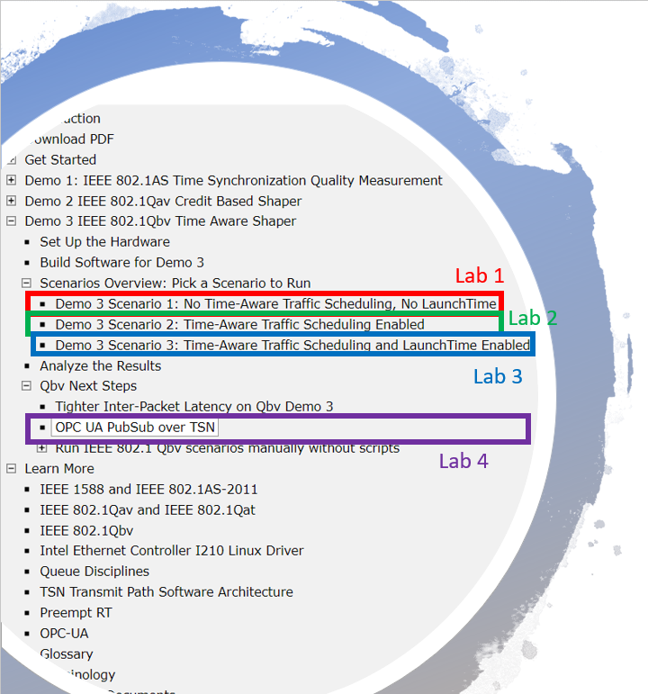

# Time Sensitive Networking Labs

Download the [TSN Labs Archive File](./iotg_tsn_ref_sw-userguide-20190131.zip). Unzip it and begin in the **TSN_UG_index.htm**.

## Lab 1 - Demo 3: IEEE 802.1Qbv Time Aware Shaper

These are the three Time Sensitive Networking labs that we will work
through.

**You can find them in the downloaded [TSN Labs Archive File](./iotg_tsn_ref_sw-userguide-20190131.zip) under Demo 3**
* IEEE 802.1Qbv Demo 3 Scenario 1: Without Time-Aware Traffic Scheduling or LaunchTime
* IEEE 802.1Qbv Demo 3 Scenario 2 Time-Aware Traffic Scheduling Enabled
* IEEE 802.1Qbv Demo 3 Scenario 3 Time-Aware Traffic Scheduling and LaunchTime Enabled
* OPC UA PubSub over TSN With Time-Aware Scheduling and LaunchTime Enabled

This sample application demonstrates the use of the Linux networking technology called taprio qdisc as a software implementation of Time Aware Shaper transmission gates, defined in IEEE 802.1Qbv. Refer to IEEE 802.1Qbv for a deeper understanding of:

Time-aware shaper and the associated per-queue transmit window configuration (called gate control list)
The software architecture of this demo
The software components of this demo
In this demo, Time Aware Shaper is used to create a protected transmission window for scheduled traffic, which requires low and bounded transmission latency. Scheduled traffic is the term used in IEEE 802.1Qbv to refer to periodic traffic such as industrial automation control frames. This type of traffic is short in frame length and requires immediate transmission when its schedule starts.

In addition, the LaunchTime feature of the Intel® Ethernet Controller I210 helps further reduce transmission latency for scheduled traffic. The demo application uses etf qdisc to transmit frames to the Linux kernel Ethernet driver in the right order according to the specified transmit time (Tx Time). Per-frame Tx Time is set by the user-space application through the Linux socket interface control message (CMSG) API interface.

This section uses three scenarios to demonstrate the benefits of using Time-Aware Traffic Scheduling and LaunchTime to reduce transmission jitter and latency for scheduled traffic. Inter-packet latency (for scheduled traffic only) measures how well the scheduled traffic is transmitted in the defined cycle time. In all of the scenarios, Board A transmits scheduled traffic and best effort traffic. The difference lies in the transmit configuration used in Board A in each scenario:

Demo 3 Scenario 1 No Time-Aware Traffic Scheduling: Both Time-Aware Traffic Scheduling and LaunchTime are disabled
Demo 3 Scenario 2 Only Time-Aware Traffic Scheduling is Enabled
Demo 3 Scenario 3 Both Time-Aware Traffic Scheduling and LaunchTime are enabled
